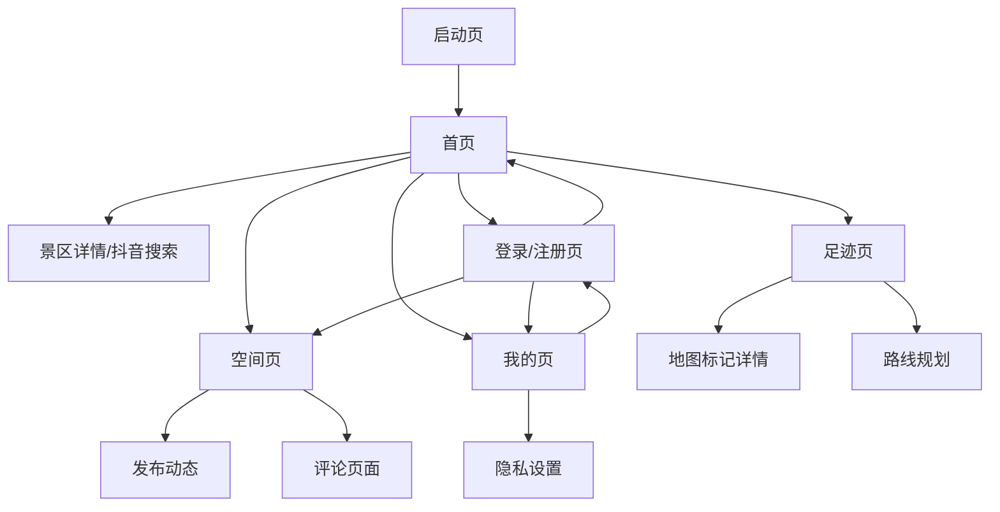
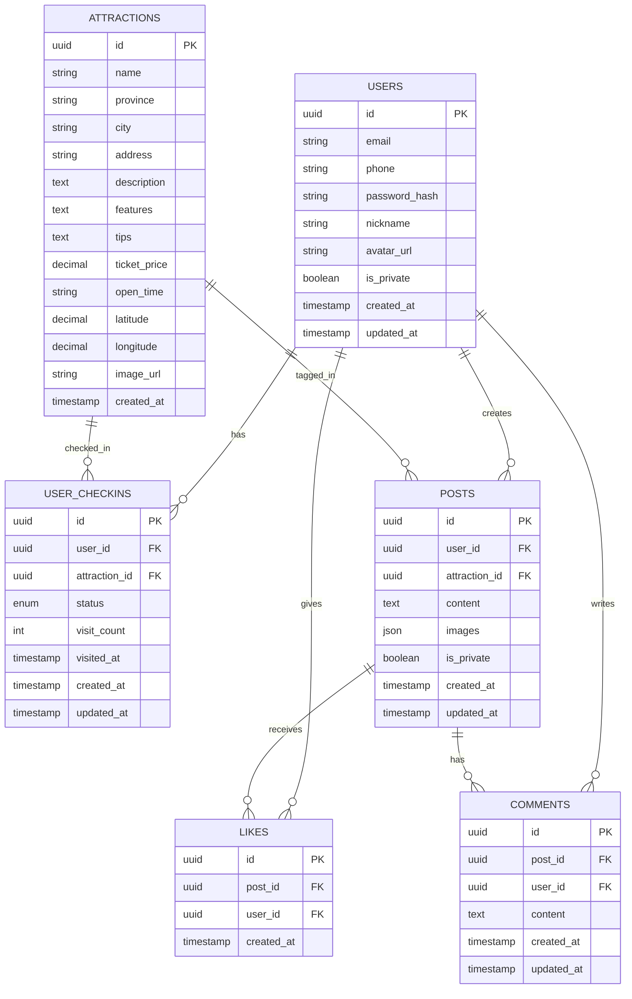

# 足迹 - 中国5A级景区打卡 产品需求文档

## 1. 产品概述

**足迹**是一款面向旅游爱好者和打卡达人的中国5A级景区打卡应用，帮助用户发现优质景区、记录旅行足迹、分享旅行故事。

- **目标用户**：旅游爱好者、打卡达人、喜欢记录和分享旅行经历的人群
- **核心价值**：发现景区 → 规划行程 → 打卡记录 → 社交分享，形成完整的旅行体验闭环
- **市场定位**：专注于中国5A级景区的垂直类旅行社交应用

## 2. 核心功能

### 2.1 用户角色

| 角色 | 注册方式 | 核心权限 |
|------|----------|----------|
| 游客用户 | 无需注册 | 浏览景区列表、查看景区详情 |
| 注册用户 | 手机号/邮箱 + 验证码注册 | 打卡标记、发布动态、点赞评论、个人空间管理 |

### 2.2 功能模块

本产品包含以下核心页面：

1. **首页（景区推荐）**：省份筛选、景区卡片列表、状态标记
2. **足迹（地图打卡）**：百度地图展示、路线规划、标记管理
3. **空间（社交广场）**：动态发布、点赞评论、内容流
4. **我的（个人中心）**：用户信息、隐私设置、打卡统计
5. **登录/注册页**：用户认证入口

### 2.3 页面详情

| 页面名称 | 模块名称 | 功能描述 |
|----------|----------|----------|
| 首页 | 顶部导航栏 | 显示App Logo和页面标题 |
| 首页 | 省份筛选标签 | 横向滚动标签栏，包含"全部"及34个省级行政区，点击筛选对应省份景区 |
| 首页 | 景区卡片列表 | 展示景区名称、位置信息（📍 省份·城市）、简介、门票价格（💎 XX元）、开放时间（🕐 XX:XX-XX:XX） |
| 首页 | 状态标记按钮 | 卡片右侧显示当前标记状态（已打卡/想要去/未标记），点击切换状态 |
| 首页 | 跳转抖音搜索 | 点击卡片跳转至抖音搜索页面，URL格式：https://www.douyin.com/search/城市%20景区名 |
| 足迹 | 百度地图容器 | 加载百度地图，支持缩放、拖拽浏览 |
| 足迹 | 地图标记点 | 不同颜色/图标区分已打卡（绿色）和想去（橙色）的景区位置 |
| 足迹 | 标记点详情弹窗 | 点击标记点弹出景区名称、地址、状态信息 |
| 足迹 | 路线规划功能 | 选择多个已打卡景区，生成最优旅游路线 |
| 空间 | 动态发布入口 | 已打卡景区可发布相册（最多9张）和文字记录 |
| 空间 | 动态内容流 | 瀑布流展示所有公开的打卡动态，包含用户信息、景区信息、图文内容 |
| 空间 | 互动功能 | 支持点赞（❤️）、评论（💬），显示数量统计 |
| 空间 | 内容管理 | 用户可删除自己发布的动态内容 |
| 我的 | 用户信息展示 | 显示头像、昵称、注册时间等基本信息 |
| 我的 | 打卡统计 | 展示已打卡景区数量、想去景区数量、发布动态数量 |
| 我的 | 隐私设置 | "空间内容仅自己可见"开关，控制动态是否公开 |
| 登录/注册 | 登录表单 | 支持手机号/邮箱 + 密码登录 |
| 登录/注册 | 注册表单 | 手机号/邮箱 + 验证码 + 密码注册 |

## 3. 核心流程

### 3.1 新用户流程

1. 打开App → 浏览首页景区推荐（无需登录）
2. 点击"我的"或尝试打卡/发布 → 跳转登录页
3. 选择注册 → 填写手机号/邮箱 → 获取验证码 → 设置密码 → 注册成功
4. 自动登录 → 返回原操作页面

### 3.2 景区打卡流程

1. 在首页浏览景区列表或使用省份筛选
2. 找到感兴趣的景区 → 点击卡片右侧标记按钮
3. 选择"已打卡"或"想要去" → 状态更新
4. 选择"已打卡"时，可跳转到空间发布打卡动态

### 3.3 社交互动流程

1. 进入空间Tab → 浏览动态内容流
2. 看到感兴趣的动态 → 点击点赞或评论
3. 点击评论输入框 → 输入内容 → 发送评论
4. 查看自己的动态 → 可选择删除

### 3.4 地图足迹流程

1. 进入足迹Tab → 加载百度地图
2. 查看已打卡（绿色标记）和想去（橙色标记）的景区分布
3. 点击标记点 → 查看景区详情弹窗
4. 使用路线规划功能 → 选择多个景区 → 生成最优路线

### 页面导航流程图



## 4. 用户界面设计

### 4.1 设计风格

- **主色调**：
  - 主色：#10B981（翠绿色，象征自然与旅行）
  - 辅色：#F59E0B（琥珀色，用于"想去"状态）
  - 背景色：#F9FAFB（浅灰白）
  - 文字色：#1F2937（深灰）、#6B7280（中灰）
- **按钮样式**：圆角矩形（radius: 8px），主按钮填充色，次按钮描边
- **字体**：系统默认字体，标题16-18px，正文14px，辅助信息12px
- **布局风格**：移动端卡片式布局，底部Tab导航，顶部可滚动标签栏
- **图标风格**：使用线性图标，简洁现代，配合emoji增强表达

### 4.2 页面设计概述

| 页面名称 | 模块名称 | UI元素 |
|----------|----------|--------|
| 首页 | 顶部标签栏 | 横向滚动，标签间距12px，选中状态底部绿色下划线，未选中灰色文字 |
| 首页 | 景区卡片 | 白色背景，圆角12px，阴影elevation-1，左侧图片（80x80px圆角8px），右侧信息区，最右状态按钮 |
| 首页 | 状态按钮 | 已打卡-绿色实心按钮，想去-橙色实心按钮，未标记-灰色描边按钮 |
| 足迹 | 地图区域 | 全屏地图，顶部浮动筛选栏（全部/已打卡/想去），右下角定位按钮 |
| 足迹 | 标记点 | 已打卡-绿色定位图标，想去-橙色定位图标，带景区名称标签 |
| 足迹 | 路线规划面板 | 底部抽屉式面板，多选景区列表，生成路线按钮 |
| 空间 | 动态卡片 | 白色背景，顶部用户信息（头像+昵称+时间），中间图文内容，底部互动栏 |
| 空间 | 发布页面 | 顶部图片选择区（九宫格），中间文本输入框，底部景区选择器 |
| 空间 | 评论区 | 底部固定输入框，上方评论列表，嵌套回复样式 |
| 我的 | 用户信息区 | 顶部渐变背景（绿到青），居中头像（80px圆形），昵称、简介 |
| 我的 | 统计卡片 | 三列等宽，数字+标签，绿色数字高亮 |
| 我的 | 设置列表 | 白色背景卡片，开关控件、箭头导航 |

### 4.3 响应式设计

- **平台适配**：H5移动端优先，适配iOS Safari和Android Chrome
- **屏幕适配**：支持320px-428px宽度屏幕，使用flexible布局
- **交互优化**：
  - 触摸区域最小44x44px
  - 列表支持下拉刷新、上拉加载更多
  - 图片懒加载，占位图过渡
  - 地图支持双指缩放、单指拖拽

### 4.4 交互动效

- **页面切换**：底部Tab切换时，图标有轻微弹跳动画（scale 1.0→0.9→1.0）
- **卡片点击**：点击景区卡片时，有轻微按压效果（scale 0.98）
- **状态切换**：标记状态改变时，按钮有颜色渐变过渡（200ms）
- **列表加载**：骨架屏加载，内容渐显（opacity 0→1，300ms）
- **地图标记**：点击标记时，弹窗从底部滑入（translateY 100%→0，300ms ease-out）

## 5. 数据模型

### 5.1 实体关系图



### 5.2 数据字典

**用户表 (users)**
| 字段名 | 类型 | 必填 | 说明 |
|--------|------|------|------|
| id | UUID | 是 | 主键，自动生成 |
| email | VARCHAR(255) | 否 | 邮箱，唯一 |
| phone | VARCHAR(20) | 否 | 手机号，唯一 |
| password_hash | VARCHAR(255) | 是 | 密码哈希 |
| nickname | VARCHAR(100) | 是 | 用户昵称 |
| avatar_url | VARCHAR(500) | 否 | 头像URL |
| is_private | BOOLEAN | 否 | 空间是否私密，默认false |
| created_at | TIMESTAMP | 是 | 创建时间 |
| updated_at | TIMESTAMP | 是 | 更新时间 |

**景区表 (attractions)**
| 字段名 | 类型 | 必填 | 说明 |
|--------|------|------|------|
| id | UUID | 是 | 主键，自动生成 |
| name | VARCHAR(200) | 是 | 景区名称 |
| province | VARCHAR(50) | 是 | 省份 |
| city | VARCHAR(50) | 是 | 城市 |
| address | VARCHAR(300) | 否 | 详细地址 |
| description | TEXT | 否 | 景区简介 |
| features | TEXT | 否 | 特色介绍 |
| tips | TEXT | 否 | 智能建议 |
| ticket_price | DECIMAL(10,2) | 否 | 门票价格 |
| open_time | VARCHAR(50) | 否 | 开放时间 |
| latitude | DECIMAL(10,8) | 是 | 纬度 |
| longitude | DECIMAL(11,8) | 是 | 经度 |
| image_url | VARCHAR(500) | 否 | 景区图片URL |
| created_at | TIMESTAMP | 是 | 创建时间 |

**用户打卡表 (user_checkins)**
| 字段名 | 类型 | 必填 | 说明 |
|--------|------|------|------|
| id | UUID | 是 | 主键，自动生成 |
| user_id | UUID | 是 | 用户ID，外键 |
| attraction_id | UUID | 是 | 景区ID，外键 |
| status | ENUM | 是 | 状态：visited/want_to_visit |
| visit_count | INT | 否 | 去过次数，默认1 |
| visited_at | TIMESTAMP | 否 | 打卡时间 |
| created_at | TIMESTAMP | 是 | 创建时间 |
| updated_at | TIMESTAMP | 是 | 更新时间 |

**空间动态表 (posts)**
| 字段名 | 类型 | 必填 | 说明 |
|--------|------|------|------|
| id | UUID | 是 | 主键，自动生成 |
| user_id | UUID | 是 | 发布用户ID |
| attraction_id | UUID | 是 | 关联景区ID |
| content | TEXT | 否 | 文字内容 |
| images | JSON | 否 | 图片URL数组 |
| is_private | BOOLEAN | 否 | 是否私密，默认false |
| created_at | TIMESTAMP | 是 | 创建时间 |
| updated_at | TIMESTAMP | 是 | 更新时间 |

**点赞表 (likes)**
| 字段名 | 类型 | 必填 | 说明 |
|--------|------|------|------|
| id | UUID | 是 | 主键，自动生成 |
| post_id | UUID | 是 | 动态ID |
| user_id | UUID | 是 | 用户ID |
| created_at | TIMESTAMP | 是 | 创建时间 |

**评论表 (comments)**
| 字段名 | 类型 | 必填 | 说明 |
|--------|------|------|------|
| id | UUID | 是 | 主键，自动生成 |
| post_id | UUID | 是 | 动态ID |
| user_id | UUID | 是 | 用户ID |
| content | TEXT | 是 | 评论内容 |
| created_at | TIMESTAMP | 是 | 创建时间 |
| updated_at | TIMESTAMP | 是 | 更新时间 |

## 6. 接口规范

### 6.1 景区相关接口

| 接口 | 方法 | 说明 |
|------|------|------|
| /api/attractions | GET | 获取景区列表，支持province筛选、分页 |
| /api/attractions/:id | GET | 获取景区详情 |
| /api/attractions/provinces | GET | 获取所有省份列表 |

### 6.2 打卡相关接口

| 接口 | 方法 | 说明 |
|------|------|------|
| /api/checkins | GET | 获取当前用户打卡列表 |
| /api/checkins | POST | 创建/更新打卡状态 |
| /api/checkins/:id | DELETE | 取消打卡/想去标记 |
| /api/checkins/stats | GET | 获取打卡统计 |

### 6.3 动态相关接口

| 接口 | 方法 | 说明 |
|------|------|------|
| /api/posts | GET | 获取动态列表，支持分页 |
| /api/posts | POST | 发布动态 |
| /api/posts/:id | DELETE | 删除动态 |
| /api/posts/:id/like | POST | 点赞/取消点赞 |
| /api/posts/:id/comments | GET | 获取评论列表 |
| /api/posts/:id/comments | POST | 发表评论 |

## 7. 非功能性需求

### 7.1 性能要求

- 首页景区列表首屏加载时间 < 1.5s
- 地图标记点渲染 < 100个标记时无明显卡顿
- 图片懒加载，滚动流畅度达到60fps
- API响应时间 < 500ms（P95）

### 7.2 安全要求

- 用户密码使用bcrypt加密存储
- API接口使用JWT认证
- 敏感操作（删除、修改）需验证用户权限
- 图片上传限制大小和类型

### 7.3 兼容性要求

- iOS 12+ Safari
- Android 8+ Chrome
- 微信内置浏览器
- 屏幕宽度适配：320px - 428px

## 8. 附录

### 8.1 5A级景区数据来源

- 文化和旅游部官方公布名单
- 初始导入约300+个5A级景区
- 包含完整的位置信息和基础介绍

### 8.2 抖音搜索URL格式

```
https://www.douyin.com/search/{城市}%20{景区名}
```

示例：
```
https://www.douyin.com/search/杭州%20西湖
```

### 8.3 百度地图API Key配置

- 需要在百度地图开放平台申请Web端API Key
- 配置域名白名单
- 启用JavaScript API和地图