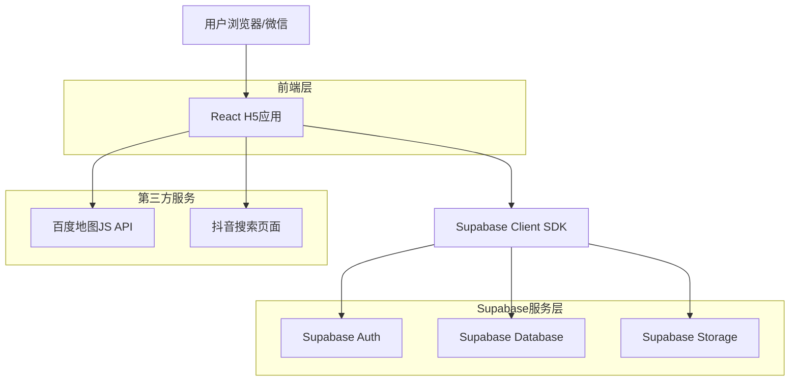
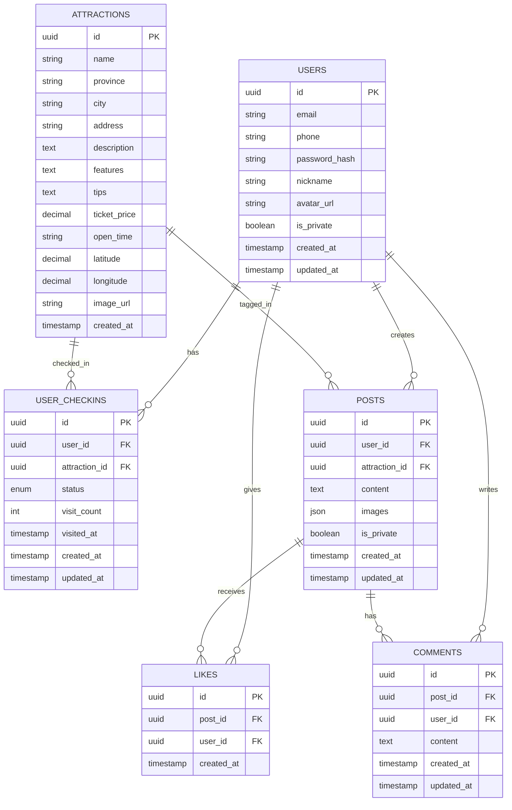

# 足迹 - 技术架构文档

## 1. 架构设计



## 2. 技术描述

* **前端**: React\@18 + TypeScript\@5 + Tailwind CSS\@3 + Vite\@5

* **状态管理**: Zustand（轻量级状态管理）

* **路由**: React Router\@6

* **地图**: 百度地图JavaScript API GL版

* **后端**: Supabase（Auth + PostgreSQL + Storage）

* **初始化工具**: vite-init

## 3. 路由定义

| 路由           | 用途         | 权限         |
| ------------ | ---------- | ---------- |
| /            | 首页，景区推荐列表  | 公开         |
| /footprint   | 足迹页，地图打卡展示 | 需登录        |
| /space       | 空间页，社交动态广场 | 公开浏览，发布需登录 |
| /profile     | 个人中心页      | 需登录        |
| /login       | 登录页        | 公开         |
| /register    | 注册页        | 公开         |
| /post/create | 发布动态页      | 需登录        |
| /post/:id    | 动态详情页      | 公开         |

## 4. 数据模型

### 4.1 实体关系图



### 4.2 数据定义语言

**用户表 (users)**

```sql
-- 使用Supabase Auth管理用户认证，扩展用户资料信息
CREATE TABLE public.profiles (
    id UUID PRIMARY KEY REFERENCES auth.users(id) ON DELETE CASCADE,
    email VARCHAR(255),
    phone VARCHAR(20),
    nickname VARCHAR(100) NOT NULL DEFAULT '游客',
    avatar_url VARCHAR(500),
    is_private BOOLEAN DEFAULT false,
    created_at TIMESTAMP WITH TIME ZONE DEFAULT NOW(),
    updated_at TIMESTAMP WITH TIME ZONE DEFAULT NOW()
);

-- 创建触发器自动更新updated_at
CREATE OR REPLACE FUNCTION update_updated_at_column()
RETURNS TRIGGER AS $$
BEGIN
    NEW.updated_at = NOW();
    RETURN NEW;
END;
$$ language 'plpgsql';

CREATE TRIGGER update_profiles_updated_at
    BEFORE UPDATE ON profiles
    FOR EACH ROW
    EXECUTE FUNCTION update_updated_at_column();

-- 权限设置
GRANT SELECT ON profiles TO anon;
GRANT ALL PRIVILEGES ON profiles TO authenticated;
```

**景区表 (attractions)**

```sql
CREATE TABLE public.attractions (
    id UUID PRIMARY KEY DEFAULT gen_random_uuid(),
    name VARCHAR(200) NOT NULL,
    province VARCHAR(50) NOT NULL,
    city VARCHAR(50) NOT NULL,
    address VARCHAR(300),
    description TEXT,
    features TEXT,
    tips TEXT,
    ticket_price DECIMAL(10,2),
    open_time VARCHAR(50),
    latitude DECIMAL(10,8) NOT NULL,
    longitude DECIMAL(11,8) NOT NULL,
    image_url VARCHAR(500),
    created_at TIMESTAMP WITH TIME ZONE DEFAULT NOW()
);

-- 创建索引
CREATE INDEX idx_attractions_province ON attractions(province);
CREATE INDEX idx_attractions_city ON attractions(city);

-- 权限设置
GRANT SELECT ON attractions TO anon;
GRANT SELECT ON attractions TO authenticated;
```

**用户打卡表 (user\_checkins)**

```sql
CREATE TABLE public.user_checkins (
    id UUID PRIMARY KEY DEFAULT gen_random_uuid(),
    user_id UUID NOT NULL REFERENCES auth.users(id) ON DELETE CASCADE,
    attraction_id UUID NOT NULL REFERENCES attractions(id) ON DELETE CASCADE,
    status VARCHAR(20) NOT NULL CHECK (status IN ('visited', 'want_to_visit')),
    visit_count INTEGER DEFAULT 1,
    visited_at TIMESTAMP WITH TIME ZONE,
    created_at TIMESTAMP WITH TIME ZONE DEFAULT NOW(),
    updated_at TIMESTAMP WITH TIME ZONE DEFAULT NOW(),
    UNIQUE(user_id, attraction_id)
);

-- 创建索引
CREATE INDEX idx_user_checkins_user_id ON user_checkins(user_id);
CREATE INDEX idx_user_checkins_attraction_id ON user_checkins(attraction_id);
CREATE INDEX idx_user_checkins_status ON user_checkins(status);

-- 触发器
CREATE TRIGGER update_user_checkins_updated_at
    BEFORE UPDATE ON user_checkins
    FOR EACH ROW
    EXECUTE FUNCTION update_updated_at_column();

-- 权限设置（使用RLS策略）
ALTER TABLE user_checkins ENABLE ROW LEVEL SECURITY;

CREATE POLICY "Users can view their own checkins"
    ON user_checkins FOR SELECT
    USING (auth.uid() = user_id);

CREATE POLICY "Users can insert their own checkins"
    ON user_checkins FOR INSERT
    WITH CHECK (auth.uid() = user_id);

CREATE POLICY "Users can update their own checkins"
    ON user_checkins FOR UPDATE
    USING (auth.uid() = user_id)
    WITH CHECK (auth.uid() = user_id);

CREATE POLICY "Users can delete their own checkins"
    ON user_checkins FOR DELETE
    USING (auth.uid() = user_id);
```

**空间动态表 (posts)**

```sql
CREATE TABLE public.posts (
    id UUID PRIMARY KEY DEFAULT gen_random_uuid(),
    user_id UUID NOT NULL REFERENCES auth.users(id) ON DELETE CASCADE,
    attraction_id UUID NOT NULL REFERENCES attractions(id) ON DELETE CASCADE,
    content TEXT,
    images JSONB DEFAULT '[]',
    is_private BOOLEAN DEFAULT false,
    created_at TIMESTAMP WITH TIME ZONE DEFAULT NOW(),
    updated_at TIMESTAMP WITH TIME ZONE DEFAULT NOW()
);

-- 创建索引
CREATE INDEX idx_posts_user_id ON posts(user_id);
CREATE INDEX idx_posts_attraction_id ON posts(attraction_id);
CREATE INDEX idx_posts_created_at ON posts(created_at DESC);
CREATE INDEX idx_posts_is_private ON posts(is_private);

-- 触发器
CREATE TRIGGER update_posts_updated_at
    BEFORE UPDATE ON posts
    FOR EACH ROW
    EXECUTE FUNCTION update_updated_at_column();

-- 权限设置（使用RLS策略）
ALTER TABLE posts ENABLE ROW LEVEL SECURITY;

CREATE POLICY "Public posts are viewable by everyone"
    ON posts FOR SELECT
    USING (is_private = false OR auth.uid() = user_id);

CREATE POLICY "Users can insert their own posts"
    ON posts FOR INSERT
    WITH CHECK (auth.uid() = user_id);

CREATE POLICY "Users can update their own posts"
    ON posts FOR UPDATE
    USING (auth.uid() = user_id)
    WITH CHECK (auth.uid() = user_id);

CREATE POLICY "Users can delete their own posts"
    ON posts FOR DELETE
    USING (auth.uid() = user_id);
```

**点赞表 (likes)**

```sql
CREATE TABLE public.likes (
    id UUID PRIMARY KEY DEFAULT gen_random_uuid(),
    post_id UUID NOT NULL REFERENCES posts(id) ON DELETE CASCADE,
    user_id UUID NOT NULL REFERENCES auth.users(id) ON DELETE CASCADE,
    created_at TIMESTAMP WITH TIME ZONE DEFAULT NOW(),
    UNIQUE(post_id, user_id)
);

-- 创建索引
CREATE INDEX idx_likes_post_id ON likes(post_id);
CREATE INDEX idx_likes_user_id ON likes(user_id);

-- 权限设置（使用RLS策略）
ALTER TABLE likes ENABLE ROW LEVEL SECURITY;

CREATE POLICY "Likes are viewable by everyone"
    ON likes FOR SELECT
    TO anon, authenticated
    USING (true);

CREATE POLICY "Users can insert their own likes"
    ON likes FOR INSERT
    WITH CHECK (auth.uid() = user_id);

CREATE POLICY "Users can delete their own likes"
    ON likes FOR DELETE
    USING (auth.uid() = user_id);
```

**评论表 (comments)**

```sql
CREATE TABLE public.comments (
    id UUID PRIMARY KEY DEFAULT gen_random_uuid(),
    post_id UUID NOT NULL REFERENCES posts(id) ON DELETE CASCADE,
    user_id UUID NOT NULL REFERENCES auth.users(id) ON DELETE CASCADE,
    content TEXT NOT NULL,
    created_at TIMESTAMP WITH TIME ZONE DEFAULT NOW(),
    updated_at TIMESTAMP WITH TIME ZONE DEFAULT NOW()
);

-- 创建索引
CREATE INDEX idx_comments_post_id ON comments(post_id);
CREATE INDEX idx_comments_user_id ON comments(user_id);
CREATE INDEX idx_comments_created_at ON comments(created_at DESC);

-- 触发器
CREATE TRIGGER update_comments_updated_at
    BEFORE UPDATE ON comments
    FOR EACH ROW
    EXECUTE FUNCTION update_updated_at_column();

-- 权限设置（使用RLS策略）
ALTER TABLE comments ENABLE ROW LEVEL SECURITY;

CREATE POLICY "Comments are viewable by everyone"
    ON comments FOR SELECT
    TO anon, authenticated
    USING (true);

CREATE POLICY "Users can insert their own comments"
    ON comments FOR INSERT
    WITH CHECK (auth.uid() = user_id);

CREATE POLICY "Users can update their own comments"
    ON comments FOR UPDATE
    USING (auth.uid() = user_id)
    WITH CHECK (auth.uid() = user_id);

CREATE POLICY "Users can delete their own comments"
    ON comments FOR DELETE
    USING (auth.uid() = user_id);
```

### 4.3 初始化数据

```sql
-- 插入示例景区数据（部分5A级景区）
INSERT INTO attractions (name, province, city, address, description, ticket_price, open_time, latitude, longitude, image_url) VALUES
('故宫博物院', '北京', '北京', '北京市东城区景山前街4号', '中国明清两代的皇家宫殿，旧称紫禁城，是世界上现存规模最大、保存最为完整的木质结构古建筑之一。', 60.00, '08:30-17:00', 39.916345, 116.397155, 'https://example.com/gugong.jpg'),
('天坛公园', '北京', '北京', '北京市东城区天坛东里甲1号', '明清两代皇帝"祭天""祈谷"的场所，主要建筑有圜丘坛、皇穹宇、祈年殿等。', 34.00, '06:00-22:00', 39.883455, 116.412345, 'https://example.com/tiantan.jpg'),
('颐和园', '北京', '北京', '北京市海淀区新建宫门路19号', '中国清朝时期皇家园林，前身为清漪园，坐落在北京西郊，与圆明园毗邻。', 30.00, '06:00-20:00', 39.999982, 116.275463, 'https://example.com/yiheyuan.jpg'),
('西湖风景名胜区', '浙江', '杭州', '浙江省杭州市西湖区龙井路1号', '中国大陆首批国家重点风景名胜区和中国十大风景名胜之一，以秀丽的湖光山色和众多的名胜古迹闻名中外。', 0.00, '全天开放', 30.245560, 120.145580, 'https://example.com/xihu.jpg'),
('普陀山风景名胜区', '浙江', '舟山', '浙江省舟山市普陀区普陀山镇', '中国佛教四大名山之一，观世音菩萨教化众生的道场，素有"海天佛国"、"南海圣境"之称。', 160.00, '06:30-21:50', 29.985294, 122.384094, 'https://example.com/putuo.jpg'),
('黄山风景区', '安徽', '黄山', '安徽省黄山市黄山区汤口镇', '中华十大名山之一，天下第一奇山，以奇松、怪石、云海、温泉、冬雪"五绝"著称。', 190.00, '06:00-17:30', 30.133438, 118.167742, 'https://example.com/huangshan.jpg'),
('九寨沟风景名胜区', '四川', '阿坝', '四川省阿坝藏族羌族自治州九寨沟县漳扎镇', '世界自然遗产、国家重点风景名胜区、国家AAAAA级旅游景区，以翠海、叠瀑、彩林、雪峰、藏情、蓝冰"六绝"著称。', 169.00, '07:30-17:00', 33.260028, 103.918629, 'https://example.com/jiuzhaigou.jpg'),
('张家界国家森林公园', '湖南', '张家界', '湖南省张家界市武陵源区金鞭路279号', '中国第一个国家森林公园，以奇峰三千、秀水八百闻名，电影《阿凡达》取景地。', 225.00, '07:00-18:00', 29.325601, 110.438123, 'https://example.com/zhangjiajie.jpg'),
('秦始皇兵马俑博物馆', '陕西', '西安', '陕西省西安市临潼区秦陵北路', '世界第八大奇迹，秦始皇陵的陪葬坑，出土了 thousands of terracotta warriors and horses。', 120.00, '08:30-17:00', 34.384122, 109.278469, 'https://example.com/bingmayong.jpg'),
('华山风景名胜区', '陕西', '渭南', '陕西省渭南市华阴市玉泉路南段', '中国著名的五岳之一，以"奇险天下第一山"著称，有"华山天下险"、"奇险天下第一山"之说。', 160.00, '07:00-19:00', 34.491382, 110.066319, 'https://example.com/huashan.jpg');
```

## 5. Supabase Storage 配置

### 5.1 存储桶设置

```sql
-- 创建用户头像存储桶
INSERT INTO storage.buckets (id, name, public) 
VALUES ('avatars', 'avatars', true);

-- 创建动态图片存储桶
INSERT INTO storage.buckets (id, name, public) 
VALUES ('posts', 'posts', true);

-- 创建景区图片存储桶
INSERT INTO storage.buckets (id, name, public) 
VALUES ('attractions', 'attractions', true);
```

### 5.2 存储权限策略

```sql
-- 头像存储桶权限
CREATE POLICY "Avatar images are publicly accessible"
    ON storage.objects FOR SELECT
    USING (bucket_id = 'avatars');

CREATE POLICY "Users can upload their own avatar"
    ON storage.objects FOR INSERT
    WITH CHECK (bucket_id = 'avatars' AND auth.uid() = owner);

CREATE POLICY "Users can update their own avatar"
    ON storage.objects FOR UPDATE
    USING (bucket_id = 'avatars' AND auth.uid() = owner);

CREATE POLICY "Users can delete their own avatar"
    ON storage.objects FOR DELETE
    USING (bucket_id = 'avatars' AND auth.uid() = owner);

-- 动态图片存储桶权限
CREATE POLICY "Post images are publicly accessible"
    ON storage.objects FOR SELECT
    USING (bucket_id = 'posts');

CREATE POLICY "Users can upload their own post images"
    ON storage.objects FOR INSERT
    WITH CHECK (bucket_id = 'posts' AND auth.uid() = owner);

CREATE POLICY "Users can delete their own post images"
    ON storage.objects FOR DELETE
    USING (bucket_id = 'posts' AND auth.uid() = owner);

-- 景区图片存储桶权限（管理员可上传，所有人可查看）
CREATE POLICY "Attraction images are publicly accessible"
    ON storage.objects FOR SELECT
    USING (bucket_id = 'attractions');
```

## 6. 前端项目结构

```
src/
├── components/           # 公共组件
│   ├── Layout/          # 布局组件
│   ├── AttractionCard/  # 景区卡片
│   ├── PostCard/        # 动态卡片
│   ├── CommentList/     # 评论列表
│   └── MapContainer/    # 地图容器
├── pages/               # 页面组件
│   ├── Home/            # 首页
│   ├── Footprint/       # 足迹页
│   ├── Space/           # 空间页
│   ├── Profile/         # 个人中心
│   ├── Login/           # 登录页
│   ├── Register/        # 注册页
│   └── PostCreate/      # 发布动态页
├── hooks/               # 自定义Hooks
│   ├── useAuth.ts       # 认证相关
│   ├── useAttractions.ts # 景区数据
│   ├── useCheckins.ts   # 打卡数据
│   └── usePosts.ts      # 动态数据
├── stores/              # 状态管理
│   ├── authStore.ts     # 用户认证状态
│   └── appStore.ts      # 应用状态
├── lib/                 # 工具库
│   ├── supabase.ts      # Supabase客户端
│   └── baiduMap.ts      # 百度地图封装
├── types/               # TypeScript类型
│   └── index.ts
├── constants/           # 常量
│   └── provinces.ts     # 省份列表
└── App.tsx              # 应用入口
```

## 7. 环境变量配置

```bash
# .env
VITE_SUPABASE_URL=your_supabase_project_url
VITE_SUPABASE_ANON_KEY=your_supabase_anon_key
VITE_BAIDU_MAP_AK=your_baidu_map_api_key
```

## 8. 依赖列表

```json
{
  "dependencies": {
    "react": "^18.2.0",
    "react-dom": "^18.2.0",
    "react-router-dom": "^6.20.0",
    "@supabase/supabase-js": "^2.39.0",
    "zustand": "^4.4.7",
    "lucide-react": "^0.294.0",
    "dayjs": "^1.11.10"
  },
  "devDependencies": {
    "@types/react": "^18.2.43",
    "@types/react-dom": "^18.2.17",
    "@vitejs/plugin-react": "^4.2.1",
    "autoprefixer": "^10.4.16",
    "postcss": "^8.4.32",
    "tailwindcss": "^3.3.6",
    "typescript": "^5.3.3",
    "vite": "^5.0.8"
  }
}
```

## 9. 百度地图集成说明

### 9.1 加载方式

在 `index.html` 中引入百度地图API：

```html
<script src="https://api.map.baidu.com/api?v=3.0&ak=YOUR_BAIDU_MAP_AK"></script>
```

### 9.2 地图组件封装

```typescript
// src/lib/baiduMap.ts
export class BaiduMapService {
  private map: BMap.Map | null = null;
  
  init(container: HTMLElement, center: [number, number], zoom: number) {
    this.map = new BMap.Map(container);
    const point = new BMap.Point(center[0], center[1]);
    this.map.centerAndZoom(point, zoom);
    this.map.enableScrollWheelZoom();
    return this.map;
  }
  
  addMarker(lng: number, lat: number, title: string, icon: string) {
    if (!this.map) return;
    const point = new BMap.Point(lng, lat);
    const marker = new BMap.Marker(point, {
      title,
      icon: new BMap.Icon(icon, new BMap.Size(25, 25))
    });
    this.map.addOverlay(marker);
    return marker;
  }
  
  clearOverlays() {
    if (!this.map) return;
    this.map.clearOverlays();
  }
}
```

## 10. 性能优化建议

1. **图片优化**：使用WebP格式，配置CDN，懒加载
2. **地图优化**：标记点聚合（MarkerClusterer），按需加载
3. **数据缓存**：使用React Query或SWR缓存API响应
4. **代码分割**：按路由懒加载页面组件
5. **虚拟列表**：景区列表和动态流使用虚拟滚动

